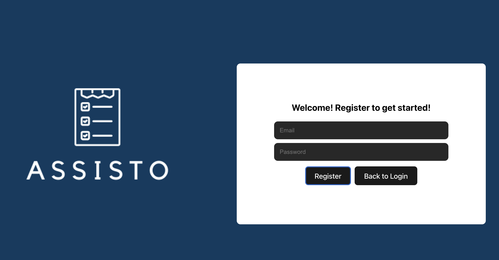
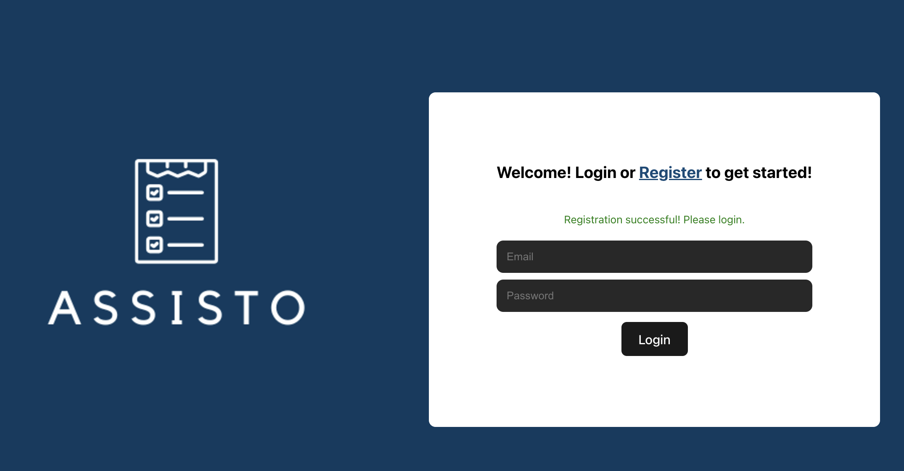
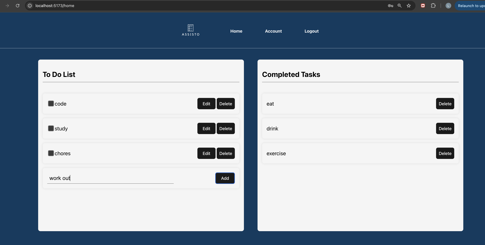
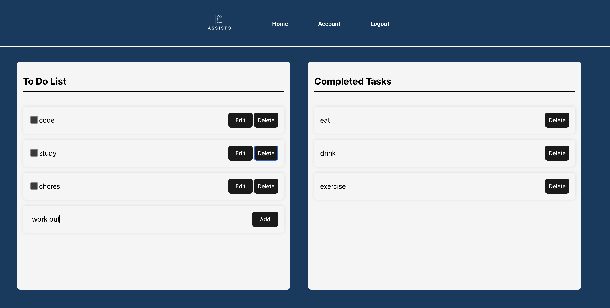
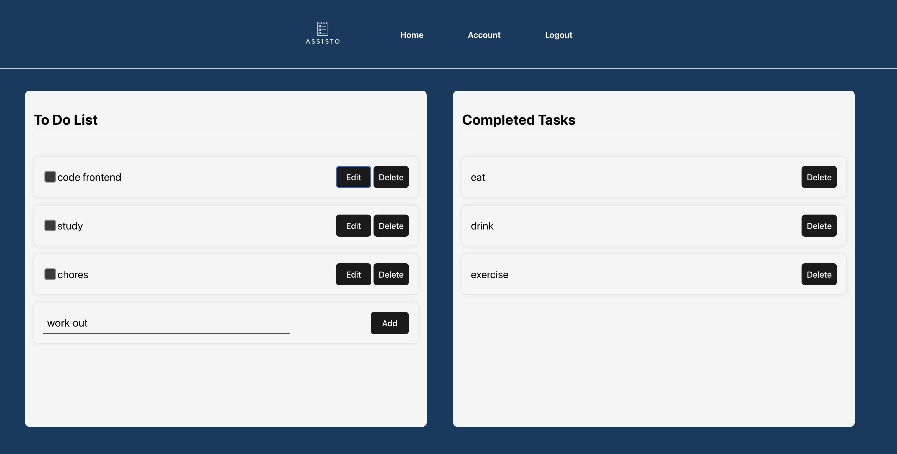
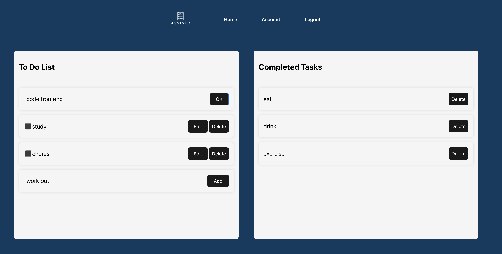
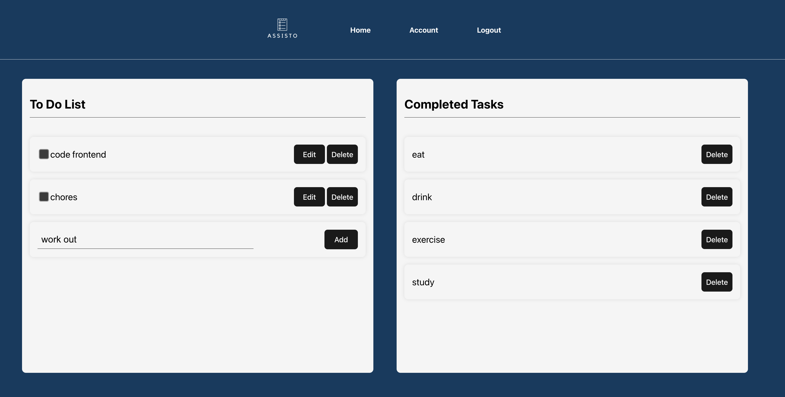
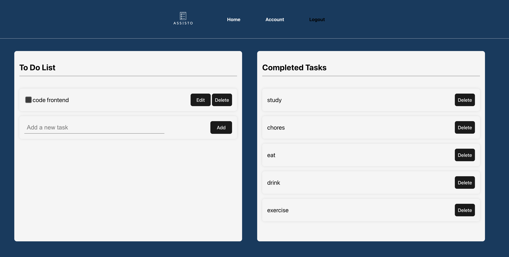

# Assisto - To-Do List Web App

## Description
Assisto is a To-Do List web app that helps users keep track of tasks they need to complete. Users can see, add, edit, and delete tasks. The backend is developed using FastAPI, and the frontend is developed using React. The database is PostgreSQL. The app is deployed on Docker containers in an AWS EC2 instance with Nginx as a reverse proxy. The URL to the web app is [https://todolistnow.com](https://todolistnow.com).

## Table of Contents
- [Installation](#installation)
- [Demo](#demo)
- [Acknowledgments](#acknowledgments)

## Installation

### Prerequisites
- Python 3.12 or higher
- Node.js version 18 or higher
- Docker and Docker Compose

### How to Install

1. **Clone the project from GitHub:**
   ```bash
   git clone https://github.com/Luna-Le/todolist.git 
   cd todolist 
   ```

2. **Open a terminal.**

### 2.1 Run Backend

1. Navigate to the backend directory and create a virtual environment:
   ```bash
   cd backend 
   python3 -m venv venv 
   ```

2. Activate the virtual environment:
   ```bash
   source venv/bin/activate 
   ```

3. Install all requirements:
   ```bash
   pip install -r requirements.txt 
   ```

4. Create an `.env` file with the necessary environment variables:
   ```plaintext
   DATABASE_HOSTNAME=your_host_here
   DATABASE_PORT=your_port_here
   DATABASE_PASSWORD=your_password_here 
   DATABASE_NAME=your_database_name_here 
   DATABASE_USERNAME=your_username_here
   SECRET_KEY=your_secret_key_here 
   ALGORITHM=your_algorithm_here 
   ACCESS_TOKEN_EXPIRE_MINUTES=your_expire_minutes_here 
   DEBUG_MODE=True/False
   ```

5. Run the backend:
   ```bash
   uvicorn app.main:app 
   ```

### 2.2 Run Frontend

1. Navigate to the frontend directory and install all requirements:
   ```bash
   cd ../frontend 
   npm install 
   ```
   Ensure Node.js is of version `>=18`.

2. Run the frontend:
   ```bash
   npm run dev 
   ```

## Demo

1. Upon opening the website, you will be asked to log in or register.
   - Click on "Register" if you have not created an account.
      
   - After creating an account, you will be redirected to the login page to log in.
      

2. Once logged in, you will be on the home page where you can:
   - Add a task by typing in the task and clicking the "Add" button.
      
   - Delete a task by clicking the "Delete" button.
      
   - Edit a task by clicking the "Edit" button, making your changes, and clicking "OK" to update it.
      
      
   - Mark a task as done by clicking the checkbox, which will move it to the completed tasks.
      
      

3. To log out, click on the "Log Out" link in the navigation bar.
      

## Acknowledgments
Thanks to all contributors and resources that helped in the development of this project.


